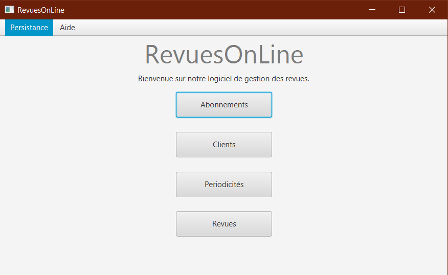
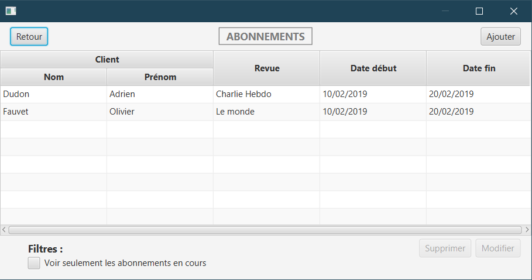
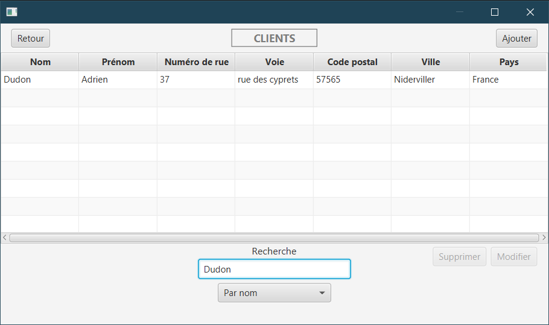
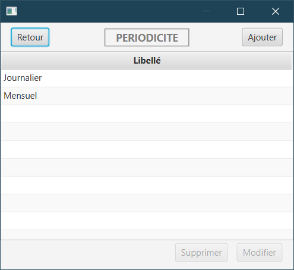

> Version Française. (English version and screenshots available below)

# RevuesOnLine

Logiciel permettant de gérer une base de données d'abonnements à des revues.  
Le programme se compose de quatre menus :

* Abonnements : permet de gérer la liste des abonnements de chaque personne.
* Clients : liste de tous les clients et de leurs informations.
* Périodicité : simple liste qui permet d'ajouter des périodes types d'abonnements (journalier, mensuel, etc.)
* Revues : liste de tous les magazines avec le tarif, la description, la périodicité.

## Ce qui est fonctionnel :

* Ajout, suppression, modification dans les listes,
* Filtres
* Trie
* Suppression avec vérification (on ne peut pas supprimer quelque chose qui est déjà utilisé ailleurs)
* Choix du mode de stockage
* Activation des boutons d'ajouts/modifications quand un élément est sélectionné

## Ne fonctionne pas :

* Comptage du nombre d'abonnement en cours dans les revues

## Informations relatives au projet

### Objectif du projet

Développer un logiciel en suivant les préceptes de l'agilité et en mettant en œuvre un ensemble de bonnes pratiques.

* Cadre : IUT (DUT Informatique)
* Matière : CPOA
* Semestre : 3
* Durée : 8 semaines
* Nombre de personnes dans le groupe : 2

### Langages et technologies utilisés

Java, JavaFX, JUnit, MySQL, Git

### Compétences visées

* Programmation événementielle
* JDBC
* Design Pattern DAO
* Architecture MVC
* Tests unitaires

### Auteurs (avec % de répartition)

* Adrien Dudon (80%)
* Olivier Fauvet (20%)

___

> English version (screenshots below)

Software for managing a database of magazines.  
The program consists of four menus:

* Abonnements (subscriptions): allows you to manage the list of subscriptions of each person.
* Clients (Customers): list of all customers and their information.
* Périodicité (Periodicity): a simple list that allows you to add typical subscription periods (daily, monthly, etc.).
* Revues (Magazines): list of all magazines with price, description, periodicity.

## Working :

* Adding, deleting and updating magzines list,
* Filtering
* Sorting
* Deleting with verification (You can't delete an item being used)
* Method storage choosing
* Add/update button being activated only when item is selected

## Do not working :

* Counting the number of current subscriptions to a magazine

## Project information

### Objective

Developing a software by following the precepts of agility and implementing a set of best practices.

* Developed with : University Institute of Technology (two-year university degree in IT)
* School Subject : CPOA
* Semester : 3
* Duration : 8 weeks
* Number of people in project group : 2

### Languages and technologies used

Java, JavaFX, JUnit, MySQL, Git

### Targeted skills

* Event programming
* JDBC
* Design Pattern DAO
* MVC Architecture
* Unit tests

### Authors (witch % of assignment)

* Adrien Dudon (80%)
* Olivier Fauvet (20%)

# Screenshots
## Accueil

## Abonnements

## Clients

## Periodicité

## Revues

