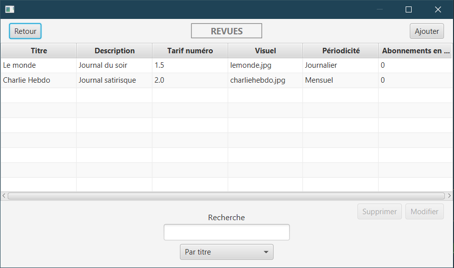

# RevuesOnLine

Software for managing a database of magazines.  
The program consists of four menus:

* Abonnements (subscriptions): allows you to manage the list of subscriptions of each person.
* Clients (Customers): list of all customers and their information.
* Périodicité (Periodicity): a simple list that allows you to add typical subscription periods (daily, monthly, etc.).
* Revues (Magazines): list of all magazines with price, description, periodicity.

## Features

* Adding, deleting and updating magzines list,
* Filtering
* Sorting
* Deleting with verification (You can't delete an item being used)
* Method storage choosing
* Add/update button being activated only when item is selected

## Known issues

* Counting the number of current subscriptions to a magazine

## Project information

### Description

Developing a software by following the precepts of agility and implementing a set of best practices in Object-Oriented Programming. This software has been created as part of the OOP courses during my studies.

### Languages and technologies used

Java, JavaFX for the GUI, JUnit for testing, MySQL, Git

### Skills

* Event programming
* JDBC
* Design Pattern DAO
* MVC Architecture
* Unit tests

### Author

* Adrien Dudon

# Screenshots
## Accueil

## Abonnements

## Clients

## Periodicité

## Revues

